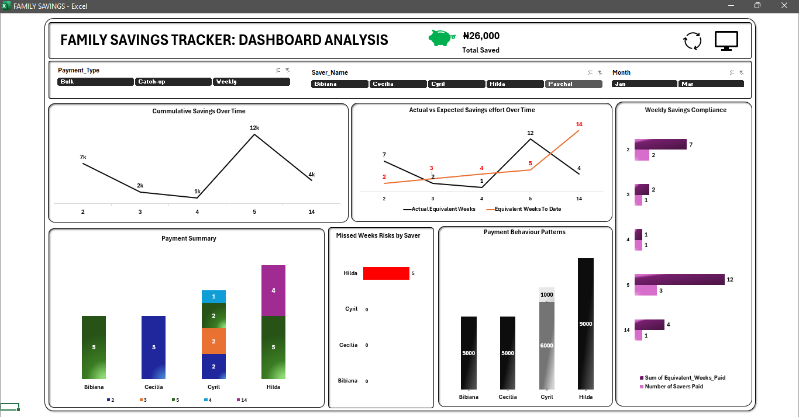

# 🏋️ Fitness Performance Tracking Dashboard

## 📌 Objective
To track and analyze workout performance, body metrics, and fitness progress over time.

## 🛠 Tools Used
- Microsoft Excel

## 🧹 Data Preparation
- Recorded daily workout data and body measurements  
- Structured dataset for consistency across time periods  
- Created calculated fields for performance tracking  

## 🔍 Analysis
- Tracked workout consistency over time  
- Analyzed trends in body metrics (e.g., weight, reps, sets)  
- Measured progress across different exercises  

## 📊 Dashboard

## 🔍 Key Insights
- Identified improvement trends in strength and endurance  
- Highlighted consistency patterns in workout routines  
- Detected plateaus in performance  

## 💡 Recommendations
- Maintain consistency in training schedule  
- Adjust workout intensity to overcome plateaus  
- Track metrics regularly to monitor progress  
